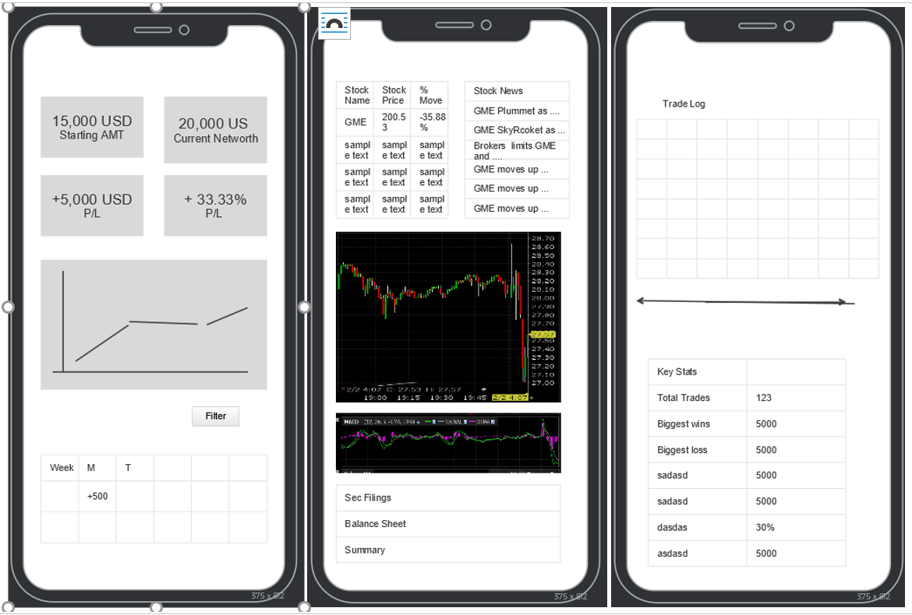

To create the best free trading journal mobile responsive website (eventually)

The objective of this site is to build interactive mobile responsive stocks website for traders that are just starting out and for experienced traders to have a one stop stats, trading journal for tracking, reviewing, decision-making and backtesting.

A good percentage for the typical traders would have to go through various phases to be profitable.

The pre-planning phase requires the typical traders to go to varioous sites to do stock scanning, stock balancesheet, patterns, historial data, news related to it... etc just for one stock ! On top of that, that is a lot of mental preparation and chart knowledge such as stop loss, projected price, chart patterns that can be executed during live trade.

The live trading phase requires a look at live charts and technical indicators to support decision making.

The post trading phase requires a look at past transcations for backtesting and trade reviewing. Users can then review their net profit/loss and percentage.
The functionalities are Users are able to enter a stock name/ticker to get relevant price/ charts/ indicators / news

Users are able to enter their starting balance and trades executed details and return their starting balance, current P/L and various more detail stats.

Users are able to filter their P/L in days/weeks/months/year

